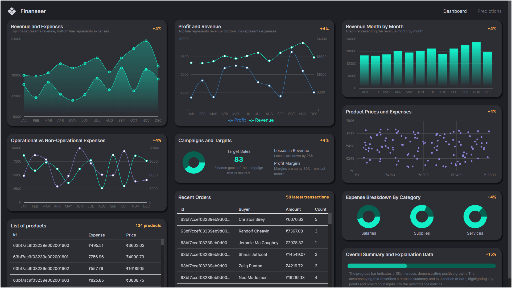
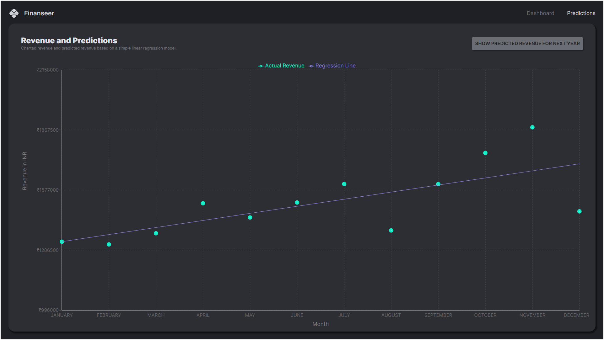
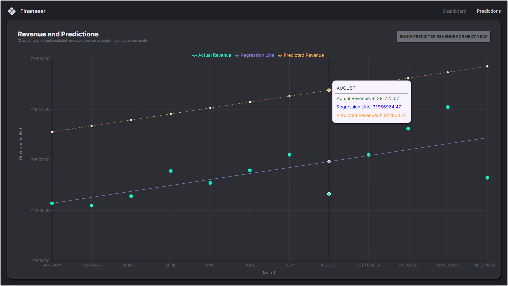

# Finance Dashboard





This project is a comprehensive finance dashboard built using React and Material-UI. The dashboard provides various financial insights and visualizations, including:

## Features

- **Revenue and Expenses**: A line chart depicting the monthly revenue and expenses.
- **Profit and Revenue**: A comparison of profit and revenue over time.
- **Revenue Month by Month**: A bar chart illustrating the revenue for each month.
- **Operational vs Non-Operational Expenses**: A detailed line chart comparing operational and non-operational expenses.
- **Product Prices and Expenses**: A scatter plot showcasing the relationship between product prices and expenses.
- **Campaigns and Targets**: Visual representation of campaign targets and achieved sales.
- **Expense Breakdown By Category**: Pie charts showing the breakdown of expenses into categories such as Salaries, Supplies, and Services.
- **Recent Orders**: A table displaying the most recent orders with details including buyer information, amount, and count.
- **Overall Summary and Explanation Data**: A progress bar and detailed explanation highlighting key performance metrics and insights.

## Installation

To get a local copy up and running, follow these steps:

1. **Clone the repository**:
    ```sh
    git clone https://github.com/Dileep01712/Finance-Dashboard.git
    ```

2. **Navigate to the project directory**:
    ```sh
    cd Finance-Dashboard
    ```

3. **Install dependencies**:
    ```sh
    npm install
    ```

4. **Start the development server**:
    ```sh
    npm start
    ```

## Usage

Open your browser and navigate to `http://localhost:3000` to view the dashboard.

## Contributing

Contributions are what make the open-source community such an amazing place to be learn, inspire, and create. Any contributions you make are **greatly appreciated**.

1. Fork the Project
2. Create your Feature Branch (`git checkout -b feature/AmazingFeature`)
3. Commit your Changes (`git commit -m 'Add some AmazingFeature'`)
4. Push to the Branch (`git push origin feature/AmazingFeature`)
5. Open a Pull Request

## License

Distributed under the MIT License. See `LICENSE` for more information.

## Contact

Project Link: [https://github.com/Dileep01712/Finance-Dashboard](https://github.com/Dileep01712/Finance-Dashboard)